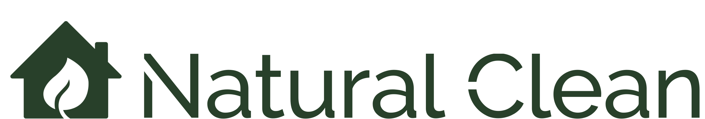

# Natural Clean

- What the project hopes to accomplish?

Natural Clean is a site that helps people to book eco-friendly cleaning services for their property in the greater Dublin area. A goal for the site is to convey the eco-friendly and clean nature of the company. To do this, images such as fruit, plants, and natural products will feature throughout the site. These images will be simplistic and minimal in nature.

- Who is the intended audience?

The site will be targeted towards commercial and residential clients, such as home owners, landlords, and business owners that are environmentally conscious or have sensitivities or allergies to chemicals.

- How is the project useful to this audience?

Natural Clean allows people to quickly and easily arrange to have their property cleaned in an environmentally friendly way.

## Features

- __Navigation Bar__

The fully responsive navigation bar includes links to all sections of the site. On the left side of the navigation bar, the company logo is presented, which itself links to the homepage of the site.

On the right side of the navigation bar, links to all sections of the site are presented to the client. If the client's screen size is using a screen size less than 950 pixels in width, then a burger menu is presented to the client, allowing them to view a dropdown menu once selected which will provide links to the site's sections.

The goal of the responsive burger menu is to provide a clutter free presentation of the site to the client. On a smaller screen size, having many navigation links could be distracting and reduce the clean aesthetic of the site.

- __The Landing Page Image__

The landing page includes a photograph of a green leaf, with text overlay providing the client with a brief introduction to what Natural Clean is. Within this text overlay, there is also a call to action button provided, allowing the user to navigate to the contact form, allowing them to quickly book our service.

The intention of the green leaf hero image is to show to the client Natural Clean's focus on being environmentally friendly, while aslso staying simple enough to keep a clean site aesthetic.

- __About Us Section__

The About Us Section will show the user the advantages of booking our green cleaning services as well as the advantages of Natural Clean's offering of 24/7 call-outs no matter the time or day to deliver a range of cleaning services.

The user will recognise the value of booking cleaning services that are exclusively non-toxic and eco-friendly in Dublin. This should persuade the user to consider using our Natural Clean site as their eco-consious, one-stop shop for any of their hypoallergenic cleaning needs.

- __Products Section__

The Products Section will detail the cleaning materials used and include useful supporting images to what the products will look like such as the 'Universal Stone Mulit-Purpose Cleaner' image and the 'Lemon Essential Oil' image.

This section will be valuable to the user to see firsthand what natural cleaning agents will be used to put clients minds at ease that only products that are safe for the planet and safe for their health will be used.

## Credits 

### Content

- HTML5 and CSS3 programming languages to create the content, structure and styles for this website.

- Javascript progamming language needed to make a FAQ accordian menu resposive on mobile devices.

- [Font Awesome](https://fontawesome.com/) for the social media icons in the footer.

- [Google Fonts](https://fonts.google.com/) to import font style.

- [Gitpod](https://www.gitpod.io/) to create the project code that can be launched from my GitHyb page.

- [GitHub](https://github.com/) to host the repository and associated files for this project and the the deployment of the website.

- [VS Code](https://code.visualstudio.com/) for IDE local deployment.

- [Navbar Tutorial Youtube](https://youtu.be/RqM5Wzuil5U) to add responsive Navbar without using javascript to site following instructions by The WebShala.

- [CSS Grid Tutorial Youtube](https://youtu.be/pMVO1OPfVJ8) & [CSS Responsive Layout Tutorial Youtube](https://youtu.be/moBhzSC455o) to build a responsive layout throughout this site.

- [FAQ Accordian Article](https://dev.to/thatanjan/how-to-build-a-beautiful-faq-accordion-menu-with-html-css-and-javascript-2p68) to add HTML/CSS/Javascript FAQ accordian menu to site following instructions by Anjan Shomooder.

- [Codepip Flexbox Froggy Game](https://codepip.com/games/flexbox-froggy/) to solidify learning flexbox for this site recommended by #learn-css thread on Slack.

- [CSS Grid Garden Game](https://cssgridgarden.com/) to solidify learning CSS grid for this site recommended by #learn-css thread on Slack.

- [W3Schools](https://www.w3schools.com/) to help learn and understand vital coding concepts used to help build this site.

- [Balsamiq](https://balsamiq.com/) to create wireframes.

- [CI Love Running](https://learn.codeinstitute.net/courses/course-v1:CodeInstitute+LR101+2021_T1/courseware/4a07c57382724cfda5834497317f24d5/4d85cd1a2c57485abbd8ccec8c00732c/) to add contact form section to site following instructions from love running walkthrough by Code Institute.

- [HTML & CSS Tutorial Youtube](https://youtu.be/D-h8L5hgW-w) to add map iframe to contact section following instructions by Gary Simon on behalf of [DesignCourse](https://designcourse.com/).

### Media

- [Adobe Color](https://color.adobe.com/color-theme-15638019#) to reference colours for this website that would look well together.

- [Brandmark](https://app.brandmark.io/) to design and create the Natural Clean Logo for this site.

- [Unsplash](https://unsplash.com/) to source professionaly high-resolution images for this website.

- [PNGEgg](https://www.pngegg.com/) to source high quality png images with a transparent background for this site.

- [Gimp 2.0](https://www.gimp.org/) to edit company logo.

