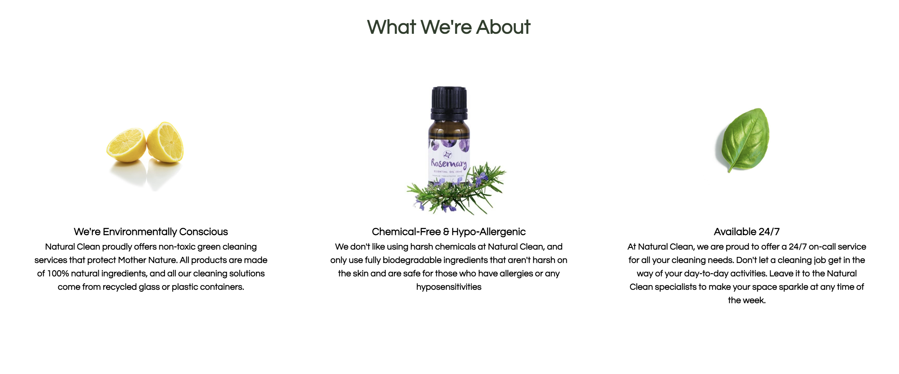
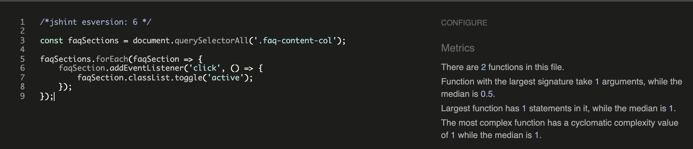

<p align="center"><a href="https://elvira-94.github.io/natural-clean/" target="_blank" rel="noopener"></a></p>


# Natural Clean

Natural Clean is a site that helps people to book eco-friendly cleaning services for their property in the greater Dublin area. A goal for the site is to convey the eco-friendly and clean nature of the company. To do this, images such as fruit, plants, and natural products will feature throughout the site. These images will be simplistic and minimal in nature.

The site will be targeted towards commercial and residential clients, such as home owners, landlords, and business owners that are environmentally conscious or have sensitivities or allergies to chemicals.

Natural Clean allows people to quickly and easily arrange to have their property cleaned in an environmentally friendly way.

You can view the live site here - <a href="https://elvira-94.github.io/natural-clean/" target="_blank" rel="noopener">Natural Clean</a>


# User Experience

## Target Audience

* Users that are looking for a professional yet eco-friendly cleaning service to come and clean their properties.
* Users that are asthma sufferers, pet-owners or have allergies that require a chemical and toxic-free cleaning service.

## User Stories

* As a user, I want to feel immediately that the site is clean and environmental once I open the homepage.
* As a user, I want to be able learn about the company and what they stand for.
* As a user, I want to be able to view the types of cleaning services on offer so that I can book the right service for my property.
* As a user, I want to be able to quickly identify what kind of cleaning materials are used so that I recieve an eco-friendly service.
* As a user, I want to be able to contact the company for a cleaning quote or for more information. 
* As a user, I want to view the company's opening hours so that I can plan to make an appointment for my property to be cleaned.

## Site Structure

The Natural Clean website is a one-page website with 6 navigation links for the visitor to use. The Home Page is the default loading page, and the sections following it are the About, Services, Products, FAQ's and Contact. The pages are all accessible primarily through the navigation menu, but the user can also press on the burger menu located on the right side of the screen if they are using a device with a small screen size. Clicking on the burger menu will allow them to view a dropdown menu of the site and visit these sections in the order listed above. This will help the user have the option of not scrolling down the website to visit these sections on different devices.

## Design Choices

### Colour Scheme

The final colour scheme chosen is one based on a darker green, lighter green, and off-white. This colour palette gives off a fresh, clean and eco-friendly atmosphere to the website, which Natural Clean hopes to pass on to the user. 

<p align="center"></p>

<p align="center"></p>

### Typography

For this website, one main font was used throughout. To give a clean modern feel, ['Questrial'](https://fonts.google.com/specimen/Questrial?query=questrial#standard-styles) designed by Joe Prince & Laura Meseguer was used for both the body text and the headings. This font defaults back to to 'Arial, Helvetica, sans-serif.' The Questrial typeface have an easy-to-read feel to them, and the full circle curves on many characters adds a refreshingly seamless look to the design while still keeping it in line with the clean style of the site by utilising letter spacing and line heights.

## Features

### Existing Features

- __Navigation Bar__

The fully responsive navigation bar includes links to all sections of the site. On the left side of the navigation bar, the company logo is presented, which itself links to the homepage of the site.

On the right side of the navigation bar, links to all sections of the site are presented to the client. If the client's screen size is using a screen size less than 950 pixels in width, then a burger menu is presented to the client, allowing them to view a dropdown menu once selected which will provide links to the site's sections.

The goal of the responsive burger menu is to provide a clutter free presentation of the site to the client. On a smaller screen size, having many navigation links could be distracting and reduce the clean aesthetic of the site.

The burger menu is implemented using only HTML and CSS. It is done so by representing the burger menu icon as a HTML form checkbox, with an image of the burger menu. Once clicked, the dropdown menu of navigation links is shown.

<details><summary><b>Navigation Bar Desktop Image</b></summary>

<p align="center"></p></details><br />

<details><summary><b>Navigation Bar Responsive Image</b></summary>

<p align="center"></p></details><br />

<details><summary><b>Navigation Bar Responsive Dropdown Menu Image</b></summary>

<p align="center"></p></details><br />


- __The Landing Page Image__

The landing page includes a photograph of a green leaf, with text overlay providing the client with a brief introduction to what Natural Clean is. Within this text overlay, there is also a call to action button provided, allowing the user to navigate to the contact form, allowing them to quickly book our service.

The intention of the green leaf hero image is to show to the client Natural Clean's focus on being environmentally friendly, while aslso staying simple enough to keep a clean site aesthetic.

<details><summary><b>Landing Page Image</b></summary>

<p align="center"></p></details><br />

- __About Us Section__

The About Us Section will show the user the advantages of booking our green cleaning services as well as the advantages of Natural Clean's offering of 24/7 call-outs no matter the time or day to deliver a range of cleaning services.

The user will recognise the value of booking cleaning services that are exclusively non-toxic and eco-friendly in Dublin. This should persuade the user to consider using our Natural Clean site as their eco-consious, one-stop shop for any of their hypoallergenic cleaning needs.

<details><summary><b>About Us Image</b></summary>

<p align="center"></p></details><br />

- __Services Section__

The Services Section will provide the user with a range of services offered by Natural Clean. The services will be displayed in a grid format around a picture of the Natural Clean logo. 

The value of this section is to allow the user to know what they can request from Natural Clean and what the request consists of. 

<details><summary><b>Services Section Image</b></summary>

<p align="center"></p></details><br />

- __Products Section__

The Products Section will detail the cleaning materials used and include useful supporting images to what the products will look like such as the 'Universal Stone Mulit-Purpose Cleaner' image and the 'Lemon Essential Oil' image.

This section will be valuable to the user to see firsthand what natural cleaning agents will be used to put clients minds at ease that only products that are safe for the planet and safe for their health will be used.

<details><summary><b>Products Section Image</b></summary>

<p align="center"></p></details><br />

- __FAQ Section__

The FAQ section will answer some of the more common questions that Natural Clean receive from their customers. The questions will be displayed as a list of accordion styled items, and once clicked, the answer to the question that was clicked, will show on the screen under the question. If clicked again, the answer will revert back to being hidden. 

The value of this section is to provide Natural Clean's users with answers to questions they may have before they need to ask.

<details><summary><b>FAQ Section Image</b></summary>

<p align="center"></p></details><br />

- __Contact Section__

The Contact Section icluding the contact form and iframe map of the company's address was created with simplicity in mind. The contact form includes a 'Get in Touch With Us heading and 3 input fields. These input fields are: Name, Email and Send Us A Message. 

The Contact Section is fully responsive and places the map image below the contact form when the device width is insufficient. The form will be centralised on the page at this point. This helps the user easily get a quote or send a message of any questions they have with ease of mind.

<details><summary><b>Contact Section Desktop Image</b></summary>

<p align="center"></p></details><br />

<details><summary><b>Contact Section Responsive Image</b></summary>

<p align="center"></p></details><br />

- __The Footer__

The Footer contains quick links, social media links and and the company logo with opening hours text below it. To improve the user experience, the quick links will quickly redirect the user back to the relevant pages sections. In addition the social media links open in a seperate tab. 

The social links to Facebook, Twitter, Instagram and Youtube are there for educational purposes of this project and will take the user to the home page of each respected site. If this site were to be published outside of this project, they would be altered to re-direct the user to the appropriate Natural Clean social media pages.

Finally the company logo itself also takes the user back to the home page and they can easily see what hours the business operates for which was an no-brainer when thinking of the users experience being a positive one.

<details><summary><b>Footer Section Image</b></summary>

<p align="center"></p></details><br />

* ## Features Left to Implement

* ### Log-in

* Allow the user to log in and create an account on the website. 
* The log in option would be located in the navigation bar and would redirect the user to a new page where they could enter their details and register an account.

* ### Testimonial Section

* A Testimonial section to highlight positive feedback regarding our services.
* This would be shown in the form of multiple 'cards' and would include a quote from the user, the user's name and a photograph of the user if they choose to provide one.

* ### Live Chat Window

* A window where a user can initiate a live chat with a staff member of Natural Clean. This allows the user to get instant feedback on any questions they may have or to book or modify a cleaning appointment instantly.

* ### Newsletter Section

* A basic newsletter section that allows the user to opt-in to monthly or bi-weekly emails from Natural Clean about the greatest cleaning hacks, special promotions and the business in general.

* ### Cleaning Mobile App

* A company cleaning app to download on iOS or android would be located in the navigation bar.
* This would redirect the user to a new page where they could download the app on their phone and register or log-in to schedule bookings via the app themselves.

# Technologies Used

* [HTML5](https://en.wikipedia.org/wiki/HTML) - to provide the content and structure for the website.
* [CSS3](https://en.wikipedia.org/wiki/CSS) - to provide the styling for the website.
* [Javascript](https://en.wikipedia.org/wiki/HTML) - to provide the responsive FAQ accordion menu for the website.
* [Gitpod](https://www.gitpod.io/) - to create and edit the website's code.
* [Github](https://github.com/) - to host and deploy the website.
* [Gitbash](https://en.wikipedia.org/wiki/Bash_(Unix_shell)) - to push changes to the GitHub repository.
* [Compressor](https://compressor.io/) - to compress the images.
* [Favicon](https://favicon.io/) - to create the favicon.
* [WCAG](https://chrome.google.com/webstore/detail/wcag-color-contrast-check/plnahcmalebffmaghcpcmpaciebdhgdf?hl=en) - to test the contrast and accessibility of the website using an extension installed on the Google browser.
* [a11y](https://color.a11y.com/Contrast/) - to test the contrast and accessibility of the website.
* [VS Code](https://code.visualstudio.com/) - to test the local deployment of the website.


# Testing

* ## Code Validation

    * The Natural Clean website has undergone extensive testing both manually and via testing tools. All the code has been validated via the [W3C HTML Validator](https://validator.w3.org/), the [W3C CSS Validator](https://jigsaw.w3.org/css-validator/) and the [JSHint Validator](https://jshint.com/). 3 minor errors were found on the index.html when tested on [HTML Validation](https://validator.w3.org/) but were fixed immediately and documented below.<br /><br />

* ### HTML Validation Image With Errors

    

* ### HTML Validation Image

    

* ### CSS Validation Image

    

* ### JS Validation Image

    

* ## Lighthouse Testing

    
    
    * When this report was first generated, the performance of the site was 94, the accessibility was 81, and the SEO was 75. 
    * These were fixed with the following updates:
        * Performance
            Images needed to be compressed in order to speed up page load times. This was done using [Compressor](https://compressor.io). The results of this were as follows:

            <details><summary><b>Pre Compression</b></summary>
            <p align="center"></p></details><br />

            
            <details><summary><b>Post Compression</b></summary>
            <p align="center"></p></details><br />

            This resulted in an increased of site performance to 95. 

        * Accessibility

            This initial report of 81 showed that the site was missing alt tags from some images, that some form elements were missing associated labels, and that iframe elements were missing a title attribute. 

            Once these issues were fixed, the accessibility score for the site increased to 100.

        * SEO

            The initial report of 75 indicated that the site was missing meta tags, and that not all images on the site had alt attributes. By the time this aspect of the site was addressed, alt attributes had been added to all images while improving the sites accessibility. Once meta tags were added to the site, the SEO score of the site increased to 100.
   

* ## Site Contrast Testing

    <details><summary><b>WCAG Report</b></summary>
    <p align="center"></p></details><br />

    * This report from [WCAG](https://chrome.google.com/webstore/detail/wcag-color-contrast-check/plnahcmalebffmaghcpcmpaciebdhgdf?hl=en) shows a single error with regards to contrast for a span element on the site. The reason for this error is due to the burger icon that displays on devices with a small screen size. This burger menu was implemented using a Youtube video reference using only CSS, as Javascript has not been covered on the course yet. This code is causing contrast issues, due to the way in which the span element for the 'nav-check' checkox input is constructed.   

    <details><summary><b>a11y Report</b></summary>
    <p align="center"></p></details><br />

    * The report from [a11y](https://color.a11y.com/Contrast/) shows a similar result to WCAG. Without this burger menu implementation, there would not be any contrast errors on the site. This is something I would like to improve upon once my knowledge of Javascript improves. 

* ## Responsiveness Testing

    * Responsiveness of the site was tested manually, using both [Google Chrome Dev Tools](https://developer.chrome.com/docs/devtools/) and [Responsive Design Checker](https://www.responsivedesignchecker.com/). The site has also been tested on multiple mobile devices physically also by friends and family. 

* ## Manual Testing

    * Throughout development, manual tests were extensively carried out: 

        * Are we viewing a fresh version of the site
            * Task: Refresh the page ensuring cache is refreshed
            * Expected Result: A non-cached version of the page has loaded for testing

        * Are all navigation links working as expected?
            * Task: Click on each navigation link on the site
            * Expected Result: You are brought to the correct location on the page. In supported browsers, smooth scrolling takes place. 

        * Are all images loading correctly?
            * Task: Look at each image on the site
            * Expected Result: The image is displaying on screen, instead of a box indicating a bad reference/url
        
        * Are all images located in the correct location?
            * Task: Look at each image on the site
            * Expected Result: Each image is located exactly as expected and is not breaching any parent divs or containers

        * Is all text content positioned correctly? 
            * Task: Look at each element of text on the screen
            * Expected Result: Each text element is locacted and centered exactly as expected, and is not breaching any parent divs or containers. 

        * Is all text content worded correctly?
            * Task: Read all text on the site
            * Expected Result: The text on the site is worded as expected 

        * Is each section of the site responding as expected for different screen sizes?
            * Task: Open Google Chrome Dev Tools and set the device screen size from small to large sizes, and back to small
            * Expected Result: The elements of the site respond as expected to changes in device screen width

        * Is the contact form requiring the correct information when the submit button is pressed?
            * Task: Click the submit button without entering required info
            * Expected Result: The form will indicate that mandatory information is missing

            * Task: Click the submit button after entering required info
            * Expected Result: The form will proceed as expected

        * Is the contact form validating email addresses as expected?
            * Task: Click the submit button after entering an invalid email address (missing '@gmail.com')
            * Expected Result: The form will indicate the error in the email field

            * Task: Click the submit button after entering an invalid email address (missing '.com')
            * Expected Result: The form will indicate the error in the email field


# Unfixed Bugs

* CSS Implementation of Burger Menu resulting in contrast errors from contrast testing tooling

    * As mentioned in the testing section, when undergoing contrast testing for the site, an error shows from a span element which is used to style the burger menu for the site.
      This is because the burger menu is implemented as a checkbox input element, styled to like a burger menu. 

      If I had more knowledge on Javascript, I would liked to have done a Javascript implementation of a burger menu. 

# Deployment

To demploy the site on GitHub pages, the following steps should be followed:

1. On your Github page, go to your site's repository.

2. Under your repository name, click **Settings**.

<p align="center"></p></details><br />

3. Click **Pages**, in the left sidebar.

<p align="center"></p></details><br />

4. Under **"GitHub Pages"**, select a publishing source from the None or Branch drop-down menu box. Then click **Save**.

<p align="center"></p></details><br />

5. The page will automatically refresh, indicating that the website has now been launched.

6. Return to the **GitHub Pages** section to obtain the link to the deployed website.

Further reading and troubleshooting on deploying a site on GitHub pages can be found [here](https://docs.github.com/en/pages/getting-started-with-github-pages/configuring-a-publishing-source-for-your-github-pages-site).

### How To Run This Site Project Locally

To clone this site's project from GitHub, the following steps should be followed:

1. On your GitHub page, go to your site's main page of your repository.

2. Above your site's files, click the **Code** button.

<p align="center"></p></details><br />

3. To clone your repository ussing HTTPS, click the copy clipboard symbol under "Clone with HTTPS".

<p align="center"></p></details><br />

4. Open your local IDE terminal.

5. Change the current working directory to the desired location for the cloned directory.

6. Type ```git clone```, followed by the URL you copied earlier in Step 3.
```console
git clone https://github.com/Elvira-94/natural-clean.git
```

7. Press Enter. Your local clone will be created.

Further reading and troubleshooting on cloning a repository from GitHub can be found [here](https://docs.github.com/en/repositories/creating-and-managing-repositories/cloning-a-repository).


# Credits 

## Acknowledgements

The Natural Clean website was built as part of my Portfolio Project 1 on behalf of a Full Stack Software Developer Diploma at the Code Institute. I'd like to thank the inspiration for this website from my mentor [Richard Wells](https://www.linkedin.com/in/richard-wells-fullstack/), co-cohort facilitator [Kasia Bogucka](https://www.linkedin.com/in/kasbogucka/), and my partner Dan, as well as the Slack community and everyone at the Code Institute for their help and loving support. Creating Natural Clean has taught me a lot, and I'm now much more confident in my abilities when it comes to planning, building, testing, and deploying a fully working website.

## Content

* [Font Awesome](https://fontawesome.com/) for the social media icons in the footer.

* [Google Fonts](https://fonts.google.com/) to import font style.

* [Navbar Tutorial Youtube](https://youtu.be/RqM5Wzuil5U) to add responsive Navbar without using javascript to site following instructions by The WebShala.

* [CSS Grid Tutorial Youtube](https://youtu.be/pMVO1OPfVJ8) & [CSS Responsive Layout Tutorial Youtube](https://youtu.be/moBhzSC455o) to build a responsive layout throughout this site.

* [FAQ Accordian Article](https://dev.to/thatanjan/how-to-build-a-beautiful-faq-accordion-menu-with-html-css-and-javascript-2p68) to add HTML/CSS/Javascript FAQ accordian menu to site following instructions by Anjan Shomooder.

* [Codepip Flexbox Froggy Game](https://codepip.com/games/flexbox-froggy/) to solidify learning flexbox for this site recommended by #learn-css thread on Slack.

* [CSS Grid Garden Game](https://cssgridgarden.com/) to solidify learning CSS grid for this site recommended by #learn-css thread on Slack.

* [W3Schools](https://www.w3schools.com/) to help learn and understand vital coding concepts used to help build this site.

* [CI Love Running](https://learn.codeinstitute.net/courses/course-v1:CodeInstitute+LR101+2021_T1/courseware/4a07c57382724cfda5834497317f24d5/4d85cd1a2c57485abbd8ccec8c00732c/) to add contact form section to site following instructions from love running walkthrough by Code Institute.

* [HTML & CSS Tutorial Youtube](https://youtu.be/D-h8L5hgW-w) to add map iframe to contact section following instructions by Gary Simon on behalf of [DesignCourse](https://designcourse.com/).

* [HubSpot](https://blog.hubspot.com/marketing/hero-image) to understand hero image best practices around site sizing.

* [StackOverflow](https://stackoverflow.com/questions/49701408/css-grid-auto-height-rows-sizing-to-content/49701488) to add automatic height sizing of CSS grid rows.

## Media

* [Adobe Color](https://color.adobe.com/color-theme-15638019#) to reference colours for this website that would look well together.

* [Brandmark](https://app.brandmark.io/) to design and create the Natural Clean Logo for this site.

* [Unsplash](https://unsplash.com/) to source professionaly high-resolution images for this website.

* [PNGEgg](https://www.pngegg.com/) to source high quality png images with a transparent background for this site.

* [Universal Stone Multi-Purpose Cleaner Image](https://www.ptpa.com/product/Universal-Stone-?quantityPerPage=all&col=rating&d=asc&reviewType=all) source used to show Universal Stone Multi-Purpose Cleaner in the products section.

* [Gimp 2.0](https://www.gimp.org/) to edit company logo.


